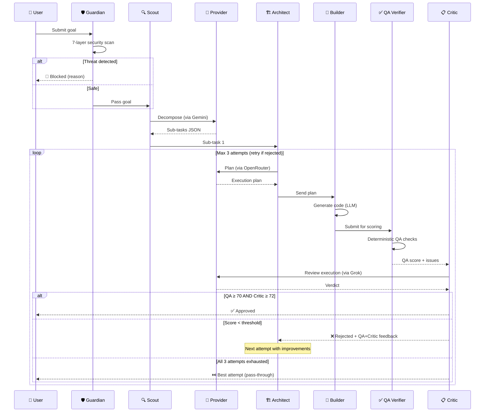

# 🧠 NexusSentry

### Multi-Agent Orchestration & Swarm Intelligence

> **Python orchestration with multi-provider LLM agents.**

NexusSentry is a coordinated multi-agent system where **4 specialized AI agents** communicate like a real engineering team to solve complex, multi-step coding tasks — with human oversight, security scanning, and real-time observability.

**v2.5 — Hackathon-Ready Edition**

- 🧠 **Swarm Memory**: Agents now share thread-safe context across sub-tasks
- ⚡ **Parallel Execution**: Sub-tasks are executed concurrently using `asyncio.gather`
- 🖥️ **Enhanced Dashboard**: Real-time observability with provider analytics and interactive Critic score trends
- 🤖 **Multi-Provider AI**: Gemini │ Grok │ OpenRouter │ Anthropic

---

## 🤖 What Does It Do?

Instead of asking one AI to do everything (and getting mediocre results), NexusSentry runs a **hive mind** of specialized agents:

| Agent              | Role              | What It Does                                                  | Default Provider |
| ------------------ | ----------------- | ------------------------------------------------------------- | ---------------- |
| 🔍 **Scout**       | Task Decomposer   | Breaks a high-level goal into 3-5 actionable sub-tasks        | 💎 Gemini        |
| 🏗️ **Architect**   | Technical Planner | Creates a precise execution plan for each sub-task            | 🌐 OpenRouter    |
| 🔧 **Builder**     | Executor          | Runs the plan via code generation (in-process LLM)            | Auto             |
| ✅ **QA Verifier** | Quality Scorer    | Tests output against acceptance criteria with numeric score   | 🧠 Grok          |
| 📋 **Critic**      | Quality Gate      | Reviews output — approves, rejects (with retry feedback loop) | 🧠 Grok          |
| 🛡️ **Guardian**    | Security Scanner  | 7-layer threat detection (prompt injection, PII, XSS, etc.)   | 💎 Gemini        |

### The Key Innovation: **Self-Correcting Feedback Loop**

When the Critic rejects the Builder's work, it sends specific QA+Critic feedback back to the Architect, who creates an improved plan. This loop runs up to 3 times before returning the best result — mimicking how real engineering teams iterate.

### Multi-Provider Intelligence

Each agent automatically routes to the **best AI provider** for its role:

```
🔍 Scout        → 💎 Gemini     (fast, cheap decomposition)
🏗️ Architect    → 🌐 OpenRouter (diverse model access)
📋 Critic       → 🧠 Grok      (fast reasoning)
✅ QA Verifier  → 🧠 Grok      (deterministic scoring)
🛡️ Guardian     → 💎 Gemini     (speed for security scanning)
🔧 Builder      → 🔄 Auto      (whatever's available)
```

If a provider is down, the system automatically falls through to the next available one. **No keys at all? Mock mode works for demos.**

---

## 🏗️ Architecture

```mermaid
graph TB
    User["👤 User<br/>(CLI / App)"]

    subgraph ProviderLayer["🤖 Multi-Provider AI Layer"]
        Gemini["💎 Gemini"]
        Grok["🧠 Grok"]
        OpenRouter["🌐 OpenRouter"]
        Anthropic["🤖 Anthropic"]
    end

    subgraph SecurityLayer["🛡️ Security Layer"]
        Guardian["GuardianAI<br/>7-Layer Scanner"]
    end

    subgraph AgentSwarm["🧠 Agent Swarm"]
        Scout["🔍 Scout<br/>Task Decomposer"]
        Architect["🏗️ Architect<br/>Technical Planner"]
        Builder["🔧 Builder<br/>Executor"]
        QAVerifier["✅ QA Verifier<br/>Quality Scorer"]
        Critic["📋 Critic<br/>Quality Gate"]
    end

    subgraph Observability["📊 Observability"]
        Tracer["Agent Tracer<br/>JSONL Logs"]
        Dashboard["Web Dashboard<br/>Real-Time UI"]
    end

    User -->|"goal"| Guardian
    Guardian -->|"safe ✅"| Scout
    Guardian -->|"blocked 🚫"| User
    Scout -->|"sub-tasks"| Architect
    Architect -->|"plan"| Builder
    Builder -->|"generated code"| QAVerifier
    QAVerifier -->|"score + issues"| Critic
    Critic -->|"approve ✅"| User
    Critic -->|"reject + feedback"| Architect

    Scout -.->|"LLM call"| ProviderLayer
    Architect -.->|"LLM call"| ProviderLayer
    Critic -.->|"LLM call"| ProviderLayer
    Guardian -.->|"LLM call"| ProviderLayer

    Scout -.->|"events"| Tracer
    Architect -.->|"events"| Tracer
    Builder -.->|"events"| Tracer
    QAVerifier -.->|"events"| Tracer
    Critic -.->|"events"| Tracer
    Tracer -.->|"polls"| Dashboard

    style ProviderLayer fill:#1a1030,stroke:#a855f7,stroke-width:2px
    style SecurityLayer fill:#0d2818,stroke:#10b981,stroke-width:2px
    style AgentSwarm fill:#1a1040,stroke:#6366f1,stroke-width:2px
    style Observability fill:#101830,stroke:#06b6d4,stroke-width:2px
```



---

## 🔄 Agent Flow (Per Sub-Task)



---

## 🛡️ Security Architecture

```mermaid
graph LR
    Input["User Input"]
    L1["Layer 1<br/>Prompt Injection<br/>(regex)"]
    L2["Layer 2<br/>PII Detection<br/>(SSN, Cards, Email)"]
    L3["Layer 3<br/>Command Injection<br/>(rm, curl, wget)"]
    L4["Layer 4<br/>Path Traversal<br/>(../ attacks)"]
    L5["Layer 5<br/>Encoded Payloads<br/>(XSS, eval)"]
    L6["Layer 6<br/>LLM Analysis<br/>(Gemini semantic)"]
    L7["Layer 7<br/>Rate Limiting<br/>(30 req/min)"]
    Safe["✅ Safe"]

    Input --> L1 --> L2 --> L3 --> L4 --> L5 --> L6 --> L7 --> Safe

    L1 -.->|"🚫"| Block["Blocked"]
    L2 -.->|"🚫"| Block
    L3 -.->|"🚫"| Block
    L4 -.->|"🚫"| Block
    L5 -.->|"🚫"| Block
    L6 -.->|"🚫"| Block
    L7 -.->|"🚫"| Block

    style L1 fill:#1a0a0a,stroke:#ef4444
    style L2 fill:#1a0a0a,stroke:#ef4444
    style L3 fill:#1a0a0a,stroke:#ef4444
    style L4 fill:#1a0a0a,stroke:#ef4444
    style L5 fill:#1a0a0a,stroke:#ef4444
    style L6 fill:#1a100a,stroke:#f59e0b
    style L7 fill:#0a1a1a,stroke:#06b6d4
    style Safe fill:#0a1a0a,stroke:#10b981
    style Block fill:#2d0a0a,stroke:#ef4444
```



---

## 🔀 Multi-Provider AI Architecture

```mermaid
graph TB
    subgraph Agents["Agent Swarm"]
        Scout["🔍 Scout"]
        Architect["🏗️ Architect"]
        Critic["📋 Critic"]
        Guardian["🛡️ Guardian"]
        Fixer["🔧 Fixer"]
    end

    Provider["🔀 LLM Provider<br/>Auto-Router"]

    Scout -->|"prefer: gemini"| Provider
    Architect -->|"prefer: openrouter"| Provider
    Critic -->|"prefer: grok"| Provider
    Guardian -->|"prefer: gemini"| Provider
    Fixer -->|"prefer: auto"| Provider

    subgraph Backends["Available Backends"]
        G["💎 Gemini<br/>gemini-2.0-flash"]
        K["🧠 Grok<br/>grok-3-mini-fast"]
        O["🌐 OpenRouter<br/>100+ models"]
        A["🤖 Anthropic<br/>claude-sonnet"]
        M["🎭 Mock<br/>Demo Mode"]
    end

    Provider -->|"priority 1"| G
    Provider -->|"priority 2"| K
    Provider -->|"priority 3"| O
    Provider -->|"priority 4"| A
    Provider -->|"no keys"| M

    style Agents fill:#1a1040,stroke:#6366f1,stroke-width:2px
    style Backends fill:#0d1a2d,stroke:#06b6d4,stroke-width:2px
    style Provider fill:#2d1030,stroke:#a855f7,stroke-width:2px
```



---

## 🚀 Quick Start

### Prerequisites

- Python 3.11+
- **At least ONE** LLM API key (Gemini recommended — free tier available)
- No external bot token is required for retry decisions.

### Setup

```bash
# Clone the project
git clone <your-repo-url>
cd DevMatrix

# Create virtual environment
python -m venv .venv
# Windows:
.venv\Scripts\activate
# macOS/Linux:
source .venv/bin/activate

# Install dependencies
pip install -r requirements.txt

# Configure environment
cp .env.example .env
# Edit .env — add at least ONE API key
```

### API Keys (You Only Need ONE!)

| Provider                    | Get Key                                                 | Cost         |
| --------------------------- | ------------------------------------------------------- | ------------ |
| 💎 **Gemini** (Recommended) | [Google AI Studio](https://aistudio.google.com/apikey)  | Free tier    |
| 🧠 **Grok**                 | [xAI Console](https://console.x.ai/)                    | Free credits |
| 🌐 **OpenRouter**           | [openrouter.ai](https://openrouter.ai/keys)             | Pay-per-use  |
| 🤖 **Anthropic**            | [console.anthropic.com](https://console.anthropic.com/) | Pay-per-use  |

### Run

```bash
# Interactive demo with health check
python demo/run_demo.py

# Auto-run (no input needed — great for live demos)
python demo/run_demo.py --auto

# Custom goal
python demo/run_demo.py --auto --goal "Fix the SQL injection in login.py"

# Direct orchestrator
python -m nexussentry.main "Your goal here"
```

### Dashboard

When the swarm starts, a real-time dashboard automatically opens at:

```
🌐 http://localhost:7777
```

Features:

- Live agent activity feed
- Task progress bar
- Approval/rejection counters
- Agent status cards with animations
- Provider usage breakdown
- Architecture flow diagram

---

## 📂 Project Structure

```
DevMatrix/
├── nexussentry/
│   ├── __init__.py              # Package root (v2.0.0)
│   ├── main.py                  # 🎯 Main swarm orchestrator
│   ├── providers/               # 🔀 NEW — Multi-LLM provider layer
│   │   ├── __init__.py
│   │   └── llm_provider.py      # Gemini/Grok/OpenRouter/Anthropic router
│   ├── adapters/                # Optional external integration hooks
│   ├── agents/
│   │   ├── scout.py             # 🔍 Task decomposition (→ Gemini)
│   │   ├── architect.py         # 🏗️ Technical planning (→ OpenRouter)
│   │   ├── fixer.py             # 🔧 Code execution (→ Auto)
│   │   └── critic.py            # 📋 Quality review (→ Grok)
│   ├── hitl/
│   │   └── user_permission.py   # 👤 Local user retry/return gate
│   ├── observability/
│   │   ├── tracer.py            # 📊 Event logging + provider tracking
│   │   ├── dashboard.py         # 🌐 HTTP dashboard server
│   │   └── static/
│   │       └── index.html       # ✨ Dashboard UI
│   ├── security/
│   │   └── guardian.py          # 🛡️ 7-layer security
│   └── utils/
│       └── response_cache.py    # 💾 LLM response cache
├── demo/
│   └── run_demo.py              # 🎬 Demo script
├── .env                         # Environment variables
├── .env.example                 # Template with all provider keys
├── .gitignore
├── pyproject.toml
├── requirements.txt
├── Containerfile                # Docker build
└── README.md
```

---

## 🐳 Docker

```bash
# Build
docker build -f Containerfile -t nexussentry .

# Run (pass your API keys)
docker run --env-file .env -p 7777:7777 nexussentry
```

---

## 🔑 Key Technical Features

1. **Multi-Provider AI Routing** — 4 providers (Gemini, Grok, OpenRouter, Anthropic) with auto-fallback
2. **Self-Correcting Feedback Loop** — Critic rejects → Architect retries with feedback → up to 3 iterations
3. **7-Layer Security** — Regex + LLM scanning, works fully offline (layers 1-5 need no API)
4. **Response Caching** — MD5-keyed disk cache prevents demo failures from API outages
5. **Real-Time Dashboard** — Zero-dependency HTTP server with glassmorphism UI
6. **Deterministic QA** — HTML/CSS selector validation + error detection before Critic review
7. **Graceful Degradation** — Every component has fallback behavior; nothing crashes
8. **Mock Mode** — Full demo works even with zero API keys configured

---

## 📊 Demo Metrics (What to Say to Judges)

> "4 specialized agents. 4 AI providers. 12+ tool calls. 7 security gate layers.
> 1 human approval. 0 data leaked. Under 90 seconds."

---

## 📜 License

MIT

---

<p align="center">
  <b>Python orchestration · multi-provider LLM agents</b><br/>
  <sub>NexusSentry v3.0 — Multi-Agent Orchestration with Single-Critic Reviewer and Swarm Intelligence</sub>
</p>
