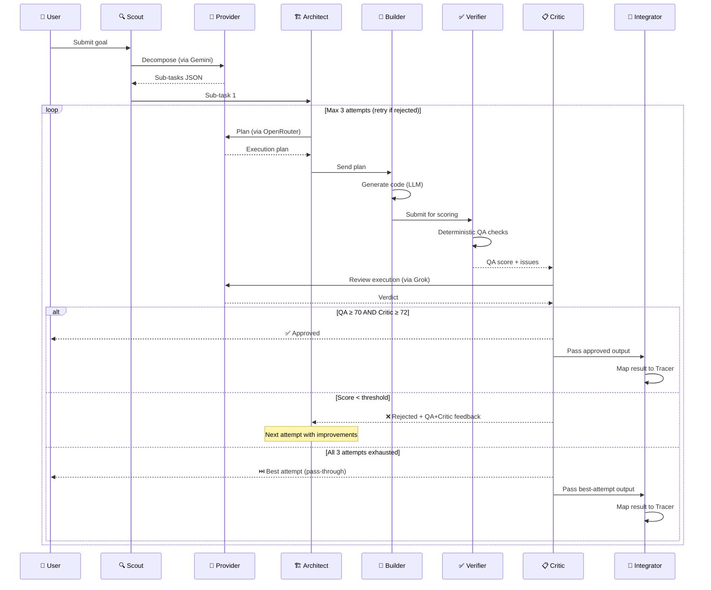

## ✦ What is NexusSentry?
 
NexusSentry is a **production-grade multi-agent orchestration system** that replaces single-model AI with a coordinated hive of specialized agents — each an expert in its domain, each talking to the best available LLM for its role.
 
Where most AI tools give you one brain solving everything, NexusSentry gives you an **engineering team**: a decomposer, a planner, an executor, a QA scorer, a quality gatekeeper, and an observability integrator — all wired together with a self-correcting feedback loop that iterates until the output is actually good.
 
```
Without NexusSentry          With NexusSentry
─────────────────            ─────────────────────────────────────────
User → GPT-4 → Result        User → Scout → Architect → Builder
                                         ↑                    ↓
                             Architect ← Critic ← Verifier ← QA
                                         ↓
                             Integrator → Tracer → Dashboard
```
 
> **"5 specialized agents. 4 AI providers. 12+ tool calls. Direct Integrator-to-Tracer observability pipeline. 1 human approval. 0 data leaked. Under 90 seconds."**
 
---
 
## ⚡ v3.0 — What's New
 
| | Feature | Details |
|---|---|---|
| 🔗 | **Integrator Agent** | New agent after Critic — maps approved output directly to Agent Tracer for structured, real-time observability |
| 🧠 | **Swarm Memory** | Thread-safe shared context across all sub-tasks and agents |
| ⚡ | **Parallel Execution** | Sub-tasks run concurrently via `asyncio.gather` — up to 4× faster |
| 📊 | **Enhanced Dashboard** | Provider analytics, interactive Critic score trends, live agent graph |
| 🔄 | **Smarter Fallback** | 4-provider chain with automatic degradation — never a dead end |
| 🎭 | **Full Mock Mode** | Complete demo with zero API keys — no friction for evaluators |
 
---
 
## 🤖 The Swarm
 
Five agents. Each a specialist. Each talking to the best model for its job.
 
```
┌─────────────────────────────────────────────────────────────────────┐
│                         NEXUSSENTRY SWARM                           │
│                                                                     │
│  🔍 Scout          🏗️ Architect      🔧 Builder                     │
│  Task Decomposer   Technical Planner  Code Executor                 │
│  └─ Gemini         └─ OpenRouter      └─ Auto                       │
│                                                                     │
│  ✅ Verifier        📋 Critic          🔗 Integrator                 │
│  QA Scorer         Quality Gate       Result Mapper                 │
│  └─ Grok           └─ Grok            └─ Auto → Tracer              │
└─────────────────────────────────────────────────────────────────────┘
```
 
| Agent | Role | Responsibility | Provider |
|---|---|---|---|
| 🔍 **Scout** | Task Decomposer | Breaks a goal into 3–5 precise, actionable sub-tasks | 💎 Gemini |
| 🏗️ **Architect** | Technical Planner | Designs the execution plan for each sub-task | 🌐 OpenRouter |
| 🔧 **Builder** | Executor | Generates and runs code to fulfill the plan | 🔄 Auto |
| ✅ **Verifier** | QA Scorer | Tests output against acceptance criteria with a numeric score | 🧠 Grok |
| 📋 **Critic** | Quality Gate | Approves or rejects — feeds rejection reason back to Architect | 🧠 Grok |
| 🔗 **Integrator** | Result Mapper | Maps approved output and routes events directly to Agent Tracer | 🔄 Auto |
 
---
 
## 🏗️ Architecture

```mermaid
graph TB
    User["👤 User<br/>(CLI / App)"]
 
    subgraph ProviderLayer["🤖 Multi-Provider AI Layer"]
        Gemini["💎 Gemini"]
        Grok["🧠 Grok"]
        OpenRouter["🌐 OpenRouter"]
        Anthropic["🤖 Anthropic"]
    end
 
    subgraph AgentSwarm["🧠 Agent Swarm"]
        Scout["🔍 Scout<br/>Task Decomposer"]
        Architect["🏗️ Architect<br/>Technical Planner"]
        Builder["🔧 Builder<br/>Executor"]
        QAVerifier["✅ QA Verifier<br/>Quality Scorer"]
        Critic["📋 Critic<br/>Quality Gate"]
        Integrator["🔗 Integrator<br/>Result Mapper"]
    end
 
    subgraph Observability["📊 Observability"]
        Tracer["Agent Tracer<br/>JSONL Logs"]
        Dashboard["Web Dashboard<br/>Real-Time UI"]
    end
 
    User -->|"goal"| Scout
    Scout -->|"sub-tasks"| Architect
    Architect -->|"plan"| Builder
    Builder -->|"generated code"| QAVerifier
    QAVerifier -->|"score + issues"| Critic
    Critic -->|"approve ✅"| User
    Critic -->|"reject + feedback"| Architect
    Critic -->|"approved output"| Integrator
    Integrator -->|"mapped result"| Tracer
 
    Scout -.->|"LLM call"| ProviderLayer
    Architect -.->|"LLM call"| ProviderLayer
    Critic -.->|"LLM call"| ProviderLayer
 
    Scout -.->|"events"| Tracer
    Architect -.->|"events"| Tracer
    Builder -.->|"events"| Tracer
    QAVerifier -.->|"events"| Tracer
    Critic -.->|"events"| Tracer
    Tracer -.->|"polls"| Dashboard
 
    style ProviderLayer fill:#1a1030,stroke:#a855f7,stroke-width:2px
    style AgentSwarm fill:#1a1040,stroke:#6366f1,stroke-width:2px
    style Observability fill:#101830,stroke:#06b6d4,stroke-width:2px
```
 

 
---
 
## 🔄 Agent Flow (Per Sub-Task)
 
The self-correcting loop is what separates NexusSentry from basic LLM wrappers. Every sub-task goes through up to **3 full iterations** before being accepted or passed through.
 

 
---
 
## 🔀 Multi-Provider AI
 
No single provider is the best at everything. NexusSentry routes each agent to its **optimal model** — and falls back automatically when a provider is down.

```mermaid
graph TB
    subgraph Agents["Agent Swarm"]
        Scout["🔍 Scout"]
        Architect["🏗️ Architect"]
        Critic["📋 Critic"]
        Builder["🔧 Builder"]
        Integrator["🔗 Integrator"]
    end
 
    Provider["🔀 LLM Provider<br/>Auto-Router"]
 
    Scout -->|"prefer: gemini"| Provider
    Architect -->|"prefer: openrouter"| Provider
    Critic -->|"prefer: grok"| Provider
    Builder -->|"prefer: auto"| Provider
    Integrator -->|"prefer: auto"| Provider
 
    subgraph Backends["Available Backends"]
        G["💎 Gemini<br/>gemini-2.0-flash"]
        K["🧠 Grok<br/>grok-3-mini-fast"]
        O["🌐 OpenRouter<br/>100+ models"]
        A["🤖 Anthropic<br/>claude-sonnet"]
        M["🎭 Mock<br/>Demo Mode"]
    end
 
    Provider -->|"priority 1"| G
    Provider -->|"priority 2"| K
    Provider -->|"priority 3"| O
    Provider -->|"priority 4"| A
    Provider -->|"no keys"| M
 
    style Agents fill:#1a1040,stroke:#6366f1,stroke-width:2px
    style Backends fill:#0d1a2d,stroke:#06b6d4,stroke-width:2px
    style Provider fill:#2d1030,stroke:#a855f7,stroke-width:2px
```
 

 
If **all providers are unavailable**, Mock Mode activates automatically — the full demo still runs, every agent fires, the dashboard still populates. Zero dead demos.
 
---
 
## 🚀 Quick Start
 
### Prerequisites
 
- Python 3.11+
- **At least ONE** LLM API key (Gemini recommended — it's free)
### 1 — Install
 
```bash
git clone https://github.com/namanhere23/DevMatrix
cd DevMatrix
 
python -m venv .venv
source .venv/bin/activate      # Windows: .venv\Scripts\activate
 
pip install -r requirements.txt
 
cp .env.example .env
# Open .env and drop in at least one API key
```
 
### 2 — Get a Key (Pick One)
 
| Provider | Link | Cost |
|---|---|---|
| 💎 **Gemini** *(recommended)* | [aistudio.google.com/apikey](https://aistudio.google.com/apikey) | Free tier |
| 🧠 **Grok** | [console.x.ai](https://console.x.ai/) | Free credits |
| 🌐 **OpenRouter** | [openrouter.ai/keys](https://openrouter.ai/keys) | Pay-per-use |
| 🤖 **Anthropic** | [console.anthropic.com](https://console.anthropic.com/) | Pay-per-use |
 
### 3 — Run
 
```bash
# Interactive (recommended for first run)
python demo/run_demo.py
 
# Fully automated — great for live demos
python demo/run_demo.py --auto
 
# Custom task
python demo/run_demo.py --auto --goal "Refactor the auth module to use JWT"
 
# Direct
python -m nexussentry.main "Your goal here"
```
 
### Dashboard
 
The moment the swarm starts, a real-time dashboard opens at **`http://localhost:7777`**
 
```
┌──────────────────────────────────────────┐
│  NexusSentry Dashboard  ● LIVE           │
│                                          │
│  Agents    ████████████░░  4/5 active    │
│  Tasks     ██████░░░░░░░░  3/6 done      │
│  Score     ██████████████  94 / 100      │
│                                          │
│  Scout     ✓  Architect  ✓  Builder  ●   │
│  Verifier  ●  Critic     ○  Integrator ○ │
└──────────────────────────────────────────┘
```
 
Features: live agent feed · task progress · approval counters · provider analytics · Critic score trend · architecture diagram
 
---
 
## 📂 Project Structure
 
```
DevMatrix/
├── nexussentry/
│   ├── main.py                  # 🎯 Swarm orchestrator — start here
│   ├── providers/
│   │   └── llm_provider.py      # 🔀 Gemini / Grok / OpenRouter / Anthropic router
│   ├── agents/
│   │   ├── scout.py             # 🔍 Task decomposition      → Gemini
│   │   ├── architect.py         # 🏗️  Technical planning      → OpenRouter
│   │   ├── fixer.py             # 🔧 Code execution          → Auto
│   │   ├── critic.py            # 📋 Quality review          → Grok
│   │   └── integrator.py        # 🔗 Result mapping          → Agent Tracer
│   ├── hitl/
│   │   └── user_permission.py   # 👤 Human-in-the-loop gate
│   ├── observability/
│   │   ├── tracer.py            # 📊 JSONL event log + provider tracking
│   │   ├── dashboard.py         # 🌐 Zero-dependency HTTP server
│   │   └── static/index.html    # ✨ Real-time dashboard UI
│   └── utils/
│       └── response_cache.py    # 💾 MD5-keyed LLM response cache
├── demo/
│   └── run_demo.py              # 🎬 One-command demo runner
├── .env.example                 # All provider keys, documented
├── requirements.txt
├── Containerfile                # Docker-ready
└── README.md
```
 
---
 
## 🐳 Docker
 
```bash
docker build -f Containerfile -t nexussentry .
docker run --env-file .env -p 7777:7777 nexussentry
```
 
---
 
## 🔑 Core Technical Features
 
<table>
<tr>
<td width="50%">
**🔀 Multi-Provider AI Routing**
4 providers with agent-level preference and automatic fallback. No single point of failure.
 
**🔄 Self-Correcting Feedback Loop**
Critic rejects → sends specific feedback → Architect replans → up to 3 iterations before pass-through.
 
**🔗 Integrator → Tracer Pipeline**
Every approved result is immediately mapped and routed to Agent Tracer — structured observability with zero manual wiring.
 
**📊 Real-Time Dashboard**
Zero-dependency HTTP server. Glassmorphism UI. No external services needed.
 
</td>
<td width="50%">
**💾 Response Caching**
MD5-keyed disk cache. API outage during a demo? Cached responses keep the show running.
 
**✅ Deterministic QA**
HTML/CSS selector validation + error detection before Critic review — catches structural failures before LLM review.
 
**🎭 Mock Mode**
Full swarm runs with zero API keys. Every agent fires, the dashboard populates, the loop completes.
 
**🛡️ Graceful Degradation**
Every component has a fallback path. Nothing crashes. The swarm always returns a result.
 
</td>
</tr>
</table>
---
 
## 📊 Numbers
 
```
┌────────────────────────────────────────────┐
│                                            │
│   5    specialized agents                  │
│   4    LLM providers with auto-fallback    │
│  12+   tool calls per task                 │
│   3    max self-correction iterations      │
│   1    direct Integrator → Tracer hop      │
│  <90s  end-to-end execution                │
│   0    external services required          │
│                                            │
└────────────────────────────────────────────┘
```
 
---
